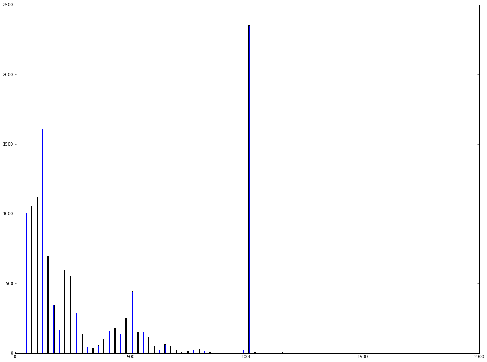
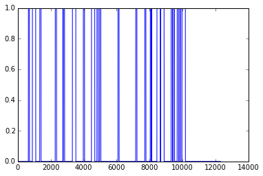
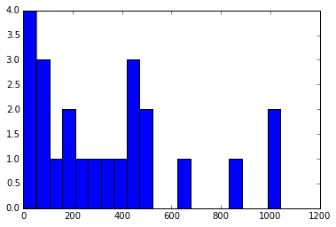

# Extract Morse Code tones from a .wav file


```python
from scipy.io import wavfile
fs, data = wavfile.read('morse-code.wav')
```


```python
%matplotlib inline
```


```python
from pylab import plot, hist
from scipy.fftpack import fft, fftfreq

```


```python

```


```python
import pandas as pd
import numpy as np
```

## Identify the frequency with the highest amplititude on an FFT.


```python
#Assume 44.1KHz sampling

def max_freq(data):
    ind = np.argmax(abs(fft(data)))
    return fftfreq(len(data), 1/44100.)[ind]

max_freqs = np.array([max_freq(data[ind:ind+2000]) for ind in range(0, data.shape[0],100)])
# pd.rolling_apply(data[:], 4000, max_freq)
```

## Histogram of max frequencies


```python
from pylab import figure
figure(figsize=(20,15))
hist(max_freqs[max_freqs < 1000], bins=500)
None
```





## Label Tones as max freq between 850 Hz and 950 Hz


```python
from pylab import hist
tones = (max_freqs > 850.) & (max_freqs < 950.)
```


```python
figure(figsize=(20,15))

tones = pd.rolling_mean(tones, 3) > 0.5
```


    <matplotlib.figure.Figure at 0x7f9e09a59d90>


```python
plot(tones)
```


    [<matplotlib.lines.Line2D at 0x7f9e2576f990>]





## Label tones and spaces 

Spaces as "False"  tones as "True". Record times corresponding to each.


```python
state=False

start_state = 0

transitions = []
times = []
for i, tone in enumerate(tones):
    if state != tone:
        transitions.append(state)
        times.append(i - start_state)
        start_state = i
    state = tone
```

## Histogram of Tone lengths


```python
hist(np.array(times)[np.where(np.array(transitions))], bins=100)
None
```





## Histogram of Space lengths


```python
hist(np.array(times)[np.where(~np.array(transitions))], bins=20)
None
```


## Sequence of Tones and Spaces with their timing


```python

for trans, time in zip(transitions,times):
    print trans,time
```

    False 636
    True 66
    False 178
    True 203
    False 245
    True 79
    False 861
    True 81
    False 387
    True 2
    False 22
    True 77
    False 474
    True 207
    False 456
    True 75
    False 420
    True 202
    False 130
    True 80
    False 82
    True 74
    False 1041
    True 71
    False 1008
    True 74
    False 477
    True 69
    False 263
    True 78
    False 2
    True 9
    False 316
    True 206
    False 20
    True 209
    False 429
    True 76
    False 53
    True 77
    False 158
    True 83
    False 63
    True 74
    False 73
    True 208


## Attempt decoding

Write detected . and - spaced out by timing (space = 8000 samples).


```python
s = ""
for trans, time in zip(transitions,times):
    label = ''
    if trans and time > 50 and time < 100:
        label = '.'
    if trans and time > 190 and time < 250:
        label = '-'
    if not trans:
        for _ in range(0, int(round(time/80))):
            s += ' '
    s += label
    
print s
```

           .  -   .          .    .     -     .     - . .             .            .     .   .   --     .. ..-


## Attemping to segment into characters

```
.  -   . R
.    .     -     . F
- . . D
. E
.     .   .  S
-- M
.. I
..- U
```

RFDESMIU


```python

```


```python

```


```python

```
